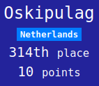

## Introduction

I am the 100πth finisher of this years Flare-On and I will share how I completed the challenges.  I won't promise I will cover all of the challenges, bet let's see how far I'll come doing so. Mandatory proof:

I think the 'anonymous' accounts are not used in the official counting, even though they are shown on the progress overview at https://2021.flare-on.com/scoreboard. So I corrected the above image for this inconvenience.

As a bonus, I will solve each challenge with a different tool.

